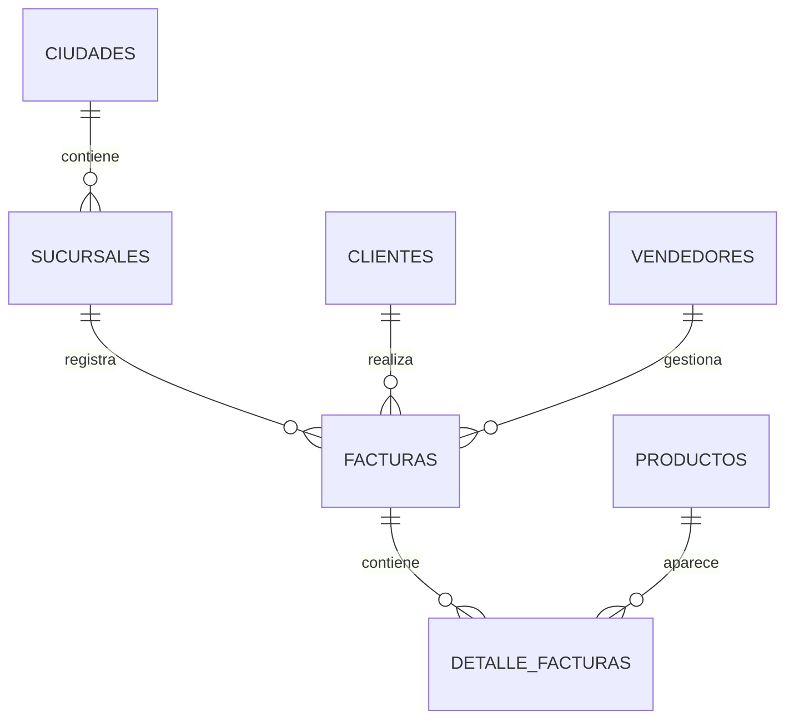
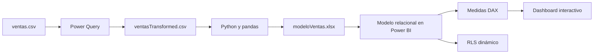

# TechCore Sales Analytics


Proyecto integral de analítica comercial desarrollado para **TechCore**, una cadena nacional de tiendas especializada en la venta de computadores. La solución transforma datos transaccionales sin procesar en un modelo relacional validado y un dashboard interactivo de Power BI orientado a la toma de decisiones.

El proyecto cubre el flujo analítico completo: **limpieza y transformación de datos, modelado relacional con Python, validación de integridad, creación de medidas DAX y visualización ejecutiva en Power BI**.

## Objetivos del proyecto

- Centralizar y depurar la información histórica de ventas de TechCore.
- Estandarizar ciudades, sucursales, productos, métodos de pago y datos de clientes.
- Diseñar un modelo relacional con claves primarias y foráneas válidas.
- Validar la consistencia de importes, relaciones y registros.
- Crear indicadores comerciales mediante DAX.
- Desarrollar un dashboard interactivo para analizar ventas por ciudad, marca, periodo, método de pago y edad del cliente.
- Identificar patrones relevantes para la toma de decisiones.
- Implementar seguridad dinámica según el usuario y su nivel de acceso.
- Documentar un flujo de trabajo reproducible y versionado con Git.

## Estructura del repositorio

```text
techcore-sales-analytics/
├── Avance_1/
│   ├── Avance_1_Limpieza_Transformacion.pbix
│   ├── ventas.csv
│   └── ventasTransformed.csv
├── Avance_2/
│   ├── Avance_2_Modelo_Relacional.ipynb
│   ├── Avance_2_Modelo_Relacional.pbix
│   ├── modeloVentas.xlsx
│   └── modelo_relacional.png
├── Avance_3/
│   └── Avance_3_Dashboard_Interactivo.pbix
├── Documentacion/
│   └── README.md
├── LICENSE
└── README.md
```

### Guía de carpetas

| Carpeta | Contenido | Propósito |
|---|---|---|
| `Avance_1` | Dataset original, dataset transformado y archivo PBIX | Limpieza, estandarización y transformación reproducible con Power Query. |
| `Avance_2` | Notebook, modelo Excel, diagrama relacional y archivo PBIX | Construcción y validación del modelo relacional con Python y Power BI. |
| `Avance_3` | Dashboard final en Power BI | KPIs, medidas DAX, filtros, jerarquías y visualizaciones interactivas. |

## Desarrollo por etapas

### 1. Limpieza y transformación

El archivo original se procesó con Power Query para garantizar consistencia y calidad antes del análisis.

Principales transformaciones:

- Corrección de tipos de datos para fechas, horas, cantidades y valores monetarios.
- Eliminación de registros duplicados.
- Tratamiento de valores vacíos o no especificados.
- Normalización de nombres de ciudades, sucursales, productos y categorías.
- Estandarización de métodos de pago.
- Corrección de caracteres y tildes en direcciones de correo electrónico.
- Creación de campos temporales auxiliares como año y mes.
- Exportación del resultado como `ventasTransformed.csv`.

### 2. Modelo relacional

El dataset transformado se procesó con **Python y pandas** para convertir la tabla transaccional en un modelo relacional preparado para Power BI.

#### Tablas generadas

| Tabla | Registros | Función |
|---|---:|---|
| `Facturas` | 30,000 | Cabecera de cada venta. |
| `DetalleFacturas` | 60,059 | Productos incluidos en cada factura. |
| `Productos` | 40 | Catálogo único de productos y precios. |
| `Clientes` | 17,453 | Información demográfica y de contacto. |
| `Sucursales` | 6 | Tiendas asociadas a cada ciudad. |
| `Ciudades` | 4 | Catálogo geográfico de ciudades. |
| `Vendedores` | 30 | Catálogo de vendedores. |

### Validaciones realizadas

- Claves primarias sin valores nulos.
- Claves primarias sin registros duplicados.
- Correspondencia entre claves primarias y foráneas.
- Productos con precios consistentes.
- Validación de subtotales por producto.
- Validación del total final de cada factura.
- Correspondencia entre ciudades y sucursales.
- Comprobación de integridad referencial.

Todas las relaciones evaluadas presentaron **cero registros inválidos**.

### Relaciones principales



El resultado se exportó a `modeloVentas.xlsx`, que contiene las tablas del modelo, reportes de control y validaciones de integridad.

### 3. Dashboard interactivo

El modelo relacional fue importado en Power BI Desktop para construir el dashboard ejecutivo `Avance_3_Dashboard_Interactivo.pbix`.

#### Indicadores DAX

| KPI | Definición |
|---|---|
| **Ventas Totales** | Suma de los subtotales aplicando el descuento correspondiente a cada factura. |
| **Ticket Promedio** | Ventas totales divididas entre la cantidad de facturas únicas. |
| **Productos Vendidos** | Suma total de unidades vendidas. |
| **Cantidad Facturas** | Conteo distinto de facturas. |
| **% Participación Ciudad** | Participación de cada ciudad sobre las ventas totales. |
| **% Venta Neta** | Proporción de ventas después de descuentos sobre el subtotal bruto. |

> **Nota:** el dataset no contiene costos de adquisición ni costos operativos. Por esta razón, no es posible calcular un margen de utilidad real; `% Venta Neta` se utiliza como una aproximación transparente basada en descuentos.

#### Visualizaciones implementadas

- Tarjetas con ventas totales, ticket promedio, productos vendidos y cantidad de facturas.
- Gráfico de barras con ventas por marca.
- Línea temporal con la evolución mensual de las ventas.
- Mapa geográfico con ventas y participación por ciudad.
- Página adicional con conclusiones e insights estratégicos.

#### Segmentadores dinámicos

- Ciudad.
- Marca del producto.
- Método de pago.
- Rango de fechas.
- Rango de edad del cliente.

#### Jerarquías

- **Fecha:** Año → Mes → Día.
- **Ubicación:** Ciudad → Sucursal.

## Principales resultados

- Las ventas analizadas alcanzan aproximadamente **$456 mil millones**.
- El ticket promedio es cercano a **$15 millones**.
- Se registraron aproximadamente **90.000 unidades vendidas**.
- El modelo contiene **30.000 facturas**.
- **Lenovo** lidera las ventas netas y las unidades comercializadas.
- **HP Spectre x360** presenta el mayor volumen de unidades vendidas.
- Medellín representa una parte significativa de las operaciones analizadas.
- Los filtros permiten explorar el desempeño por ubicación, marca, periodo, método de pago y edad.

## Tecnologías utilizadas

| Tecnología | Aplicación |
|---|---|
| Power BI Desktop | Modelado semántico, DAX, visualizaciones y RLS |
| Power Query | Limpieza, transformación y normalización |
| Python | Procesamiento y construcción del modelo relacional |
| pandas | Manipulación, validación y exportación de tablas |
| Jupyter Notebook | Desarrollo documentado y reproducible |
| Matplotlib | Generación del diagrama relacional |
| OpenPyXL | Exportación del modelo a Excel |
| Git y GitHub | Control de versiones y publicación del proyecto |

---

## Seguridad dinámica con RLS

Como funcionalidad adicional, se implementó un esquema de **Row-Level Security** basado en una tabla simulada de usuarios.

La seguridad utiliza `USERPRINCIPALNAME()` para identificar el correo del usuario autenticado y aplicar el filtro correspondiente.

### Tabla de usuarios

La tabla `Usuarios` contiene:

- Nombre del usuario.
- Correo electrónico.
- Rol asignado.
- Ciudad asociada.
- Sucursal asociada.
- Identificador de sucursal.

La tabla está relacionada con `Sucursales` mediante `SucursalID`. El filtro de seguridad se propaga desde las sucursales hacia las facturas y el resto del modelo.

### Roles configurados

| Rol | Alcance |
|---|---|
| Gerente Nacional | Acceso completo a todas las ciudades y sucursales |
| Gerente Regional | Acceso a las sucursales pertenecientes a su ciudad |
| Gerente Sucursal | Acceso exclusivo a su sucursal asignada |

### Expresiones DAX de seguridad

```DAX
-- Gerente Nacional
[Email] = USERPRINCIPALNAME()
    && [Rol] = "Gerente Nacional"
```

```DAX
-- Gerente Regional
[Email] = USERPRINCIPALNAME()
    && [Rol] = "Gerente Regional"
```

```DAX
-- Gerente Sucursal
[Email] = USERPRINCIPALNAME()
    && [Rol] = "Gerente Sucursal"
```

### Pruebas de RLS

| Perfil probado | Alcance esperado | Resultado |
|---|---|---|
| Gerente Nacional | Todas las sucursales | Acceso completo validado |
| Gerente Regional de Medellín | Dos sucursales de Medellín | Filtro regional validado |
| Gerente de Medellín #1 | Una sucursal | Filtro por sucursal validado |

Los KPIs, gráficos, mapas y segmentadores respondieron correctamente a los filtros de seguridad.

> Los correos incluidos en la tabla de usuarios son simulados y fueron creados exclusivamente con fines académicos.

---

## Cómo explorar el proyecto

### 1. Clonar el repositorio

```bash
git clone https://github.com/Dcuastumal/techcore-sales-analytics.git
cd techcore-sales-analytics
```

### 2. Revisar la limpieza

Abre:

```text
Avance_1/Avance_1_Limpieza_Transformacion.pbix
```

### 3. Ejecutar el modelo relacional

Abre y ejecuta las celdas de:

```text
Avance_2/Avance_2_Modelo_Relacional.ipynb
```

El notebook utiliza como entrada:

```text
Avance_1/ventasTransformed.csv
```

### 4. Explorar el modelo en Power BI

Abre:

```text
Avance_2/Avance_2_Modelo_Relacional.pbix
```

### 5. Explorar el dashboard final

Abre:

```text
Avance_3/Avance_3_Dashboard_Interactivo.pbix
```

> Power BI Desktop es necesario para abrir los archivos `.pbix`. GitHub permite almacenarlos y descargarlos, pero no visualizarlos directamente en el navegador.

---

### Requisitos

- Power BI Desktop.
- Python 3.10 o superior.
- Jupyter Notebook o la extensión Jupyter de VS Code.
- pandas.
- NumPy.
- Matplotlib.
- OpenPyXL.

Instala las dependencias de Python:

```bash
pip install pandas numpy matplotlib openpyxl jupyter
```

### Ejecución

1. Clona el repositorio:

   ```bash
   git clone https://github.com/Dcuastumal/techcore-sales-analytics.git
   cd techcore-sales-analytics
   ```

2. Abre `Avance_2/Avance_2_Modelo_Relacional.ipynb` y ejecuta las celdas en orden para reproducir el modelo relacional.

3. Verifica la generación de:

   - `Avance_2/modeloVentas.xlsx`
   - `Avance_2/modelo_relacional.png`

4. Abre `Avance_3/Avance_3_Dashboard_Interactivo.pbix` con Power BI Desktop para explorar el dashboard final.

> Los archivos `.pbix` no se visualizan directamente desde GitHub; deben descargarse y abrirse con Power BI Desktop.

## Flujo del proyecto



## Autor

**David Cuastumal**  
Proyecto desarrollado como parte del Módulo 3 del programa de Data Science de SoyHenry.

## Licencia

Este proyecto se distribuye bajo los términos definidos en el archivo [LICENSE](LICENSE).
